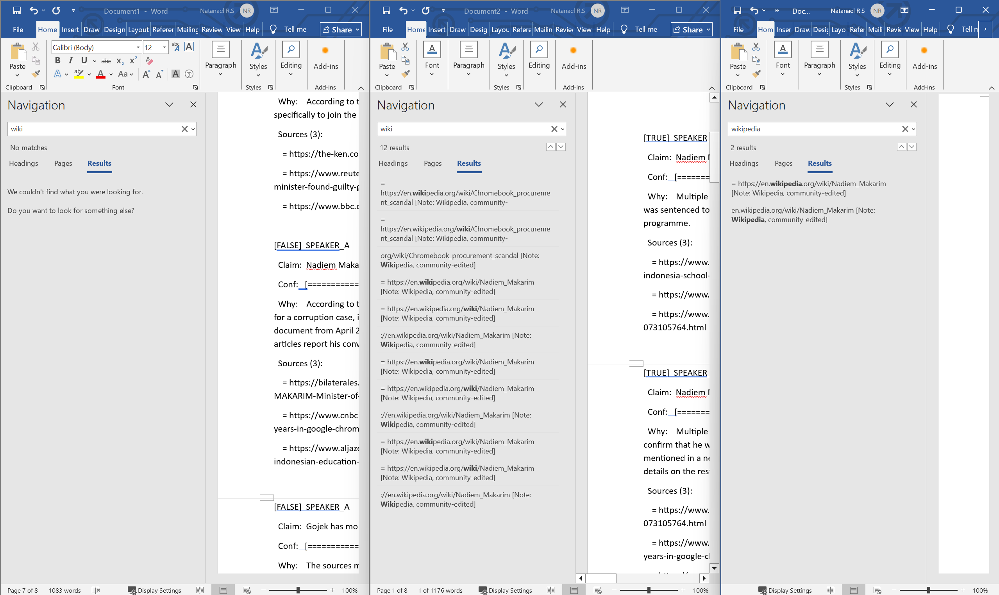

# Wikipedia Over-Representation, Work in Progress

## Test #1

When fact-checking claims, the system searches for evidence using Tavily, which returns only up to 10 results per claim. These results are then filtered to remove social/UGC domains (Facebook, YouTube, Reddit, etc.), keeping the top 3 "real" sources.

**The issue:** Wikipedia tends to rank first in Tavily results. When it does, the current pipeline doesn't deduplicate sources, it just takes whatever comes back. This means a single Wikipedia article can appear multiple times in the sources list, filling up all 3 source slots with variants of the same link.

### Real Example: Before and After

**Before (untuned code):** Searching for "wiki" in verdict output returns **12 matches** Wikipedia appears throughout the sources lists across verdicts.

**After (VERIFY_PROMPT tuned):** Searching for "wikipedia" in verdict output returns only **2 matches** Wikipedia instances dropped from 12 to 2 just by changing the prompt instruction.

---

## What Changed

### 1. Expanded Search Coverage

Increased Tavily's result fetch from 6 to 10 per claim. A broader initial pool provides better opportunities to surface authoritative sources before filtering, reducing reliance on any single dominant result (e.g., Wikipedia).

### 2. Streamlined Verdict Scale

Simplified the verdict taxonomy from 6 categories to 3 tiers:
- **6-tier (old):** TRUE, MOSTLY TRUE, PARTLY TRUE, MISLEADING, UNVERIFIABLE, FALSE
- **3-tier (new):** TRUE, UNVERIFIABLE, FALSE

This creates sharper, more decisive verdicts while reducing ambiguity in borderline cases.

### 3. Refined Source Prioritization in VERIFY_PROMPT

Enhanced the model's instructions to intelligently balance source diversity. Rather than mechanically listing whatever sources appear first in search results, the model now:
- Prioritizes authoritative and specialized sources (government, academic, established news)
- Treats Wikipedia as a supplementary source, not a primary reference
- Considers source credibility when selecting which results to cite

This subtle but powerful prompt adjustment leverages the model's reasoning capability to make better source choices, reducing Wikipedia's dominance from 12 instances to just 2, without any code modification.

**Insight:** Prompt engineering can achieve what algorithmic filtering often requires, by aligning the model's behavior with desired outcomes through clearer instructions.
---

## Results

- Wikipedia instances reduced from 12 to 2
- Verdict scale simplified to 3 tiers (more decisive)
- Tavily fetch increased to 10 results (better source diversity to choose from) 
- The result is better and more direct with the 3-tier verdict and after the prompt tuning
- You can see in the picture below (No wikipedia, before tuning the prompt, after tuning the prompt) 




---

## Real-World Test: BBC Nadiem Makarim Article

Tested the updated system against a real BBC news article about Indonesian Gojek founder Nadiem Makarim's corruption conviction (2026-06-30). 

### Verdict Distribution (3-Tier Scale)
- **TRUE:** 6 claims
- **UNVERIFIABLE:** 4 claims  
- **FALSE:** 1 claim

### Key Observations

### **Sharper verdicts from 3-tier scale (Major):** 
The compressed scale forces clearer reasoning. For example:
- "Chromebook procurement from 2021-2022" correctly marked **FALSE** (actually 2020-2021), not hedged with PARTLY TRUE
- Claims with insufficient recent evidence correctly marked **UNVERIFIABLE** instead of MOSTLY TRUE, preventing false confidence

**Better source selection:** Wikipedia appears only once (in sources for claim about Nadiem's timeline), and is flagged with a note `[Note: Wikipedia, community-edited]`. Most verdicts cite Reuters, BBC, CNBC, and official sources.

**Confidence calibration improved:** 
- High-confidence verdicts (95-100%) backed by multiple independent sources (Reuters, CNBC, Straits Times)
- 60% confidence claims properly marked UNVERIFIABLE where sources lack direct evidence (e.g., "He had pleaded not guilty" - articles mention defense plea but don't confirm plea content)

### Sample Claims

| Claim | Verdict | Confidence | Notes |
|-------|---------|-----------|-------|
| Nadiem sentenced to 10 years in prison | TRUE | 100% | 3 independent sources (Reuters, CNBC, Straits Times) |
| Chromebook procurement from 2021-2022 | FALSE | 90% | Actual timeline was 2020-2021 per multiple sources |
| He pleaded not guilty | UNVERIFIABLE | 60% | Sources mention defense plea but don't confirm content |
| Gojek has 170M+ users | UNVERIFIABLE | 60% | Most recent evidence is 2019-2020; no current data |
| Remained as minority shareholder during ministry | TRUE | 95% | Reuters directly confirms passive stakeholder status |

This test validates that the 3-tier verdict scale and expanded search coverage produce more defensible and more source grounded 
  

## Test #2
I have this text as a test to test TRUE FALSE or UNVERIFIABLE and is the wikipedia problem fixed?
```
Artificial intelligence has become one of the fastest-growing technologies in history. ChatGPT was publicly released by OpenAI in November 2022 and reached one million users in about five days. Since then, many governments and universities have begun developing policies for the responsible use of generative AI. In March 2023, Italy temporarily banned ChatGPT over privacy concerns before later restoring access. The European Union approved the AI Act in 2024, making it the world's first comprehensive AI regulation. Some experts argue that AI will eventually replace many office jobs, while others believe it will primarily augment human workers rather than replace them. OpenAI has stated that GPT-4 performs better than GPT-3.5 on many standardized benchmarks, although benchmark scores do not necessarily translate directly into real-world performance. Today, more people use generative AI than ever before, and AI adoption is increasing across industries including healthcare, education, finance, and software engineering.
```
### Output:
```
(.venv) PS C:\Users\natan\VSC Code\fact-checker> python main.py
Real-Time Fact Checker
Model: Llama 3.3 70B (DeepInfra)

Input mode:
  1. Microphone (live)
  2. Live stream URL (YouTube/news)
  3. Article URL
  4. Paste text / paragraph

> 4
Paste your text, then press Enter twice when done:
Artificial intelligence has become one of the fastest-growing technologies in history. ChatGPT was publicly released by OpenAI in November 2022 and reached one million users in about five days. Since then, many governments and universities have begun developing policies for the responsible use of generative AI. In March 2023, Italy temporarily banned ChatGPT over privacy concerns before later restoring access. The European Union approved the AI Act in 2024, making it the world's first comprehensive AI regulation. Some experts argue that AI will eventually replace many office jobs, while others believe it will primarily augment human workers rather than replace them. OpenAI has stated that GPT-4 performs better than GPT-3.5 on many standardized benchmarks, although benchmark scores do not necessarily translate directly into real-world performance. Today, more people use generative AI than ever before, and AI adoption is increasing across industries including healthcare, education, finance, and software engineering.


Extracted 1 paragraphs. Fact-checking...


[TRUE]  SPEAKER_A
  Claim:  ChatGPT was publicly released by OpenAI in November 2022
  Conf:   [===================-] 95%
  Why:    Two independent sources, including a historical website and Wikipedia, confirm that ChatGPT was released to the public by OpenAI in November 2022. The exact date of release is specified as November 30, 2022, by one of the sources.
  Sources (2):
    = https://www.history.com/this-day-in-history/november-30/chatgpt-released-openai
    = https://en.wikipedia.org/wiki/ChatGPT [Note: Wikipedia, community-edited]

[UNVERIFIABLE]  SPEAKER_A
  Claim:  ChatGPT reached one million users in about five days
  Conf:   [============--------] 60%
  Why:    The search results do not provide direct evidence of the time it took for ChatGPT to reach one million users. The sources provide information on ChatGPT's current user base, growth, and market share, but do not include historical data on the initial user acquisition rate.
  Sources (3):
    = https://www.demandsage.com/chatgpt-statistics
    = https://explodingtopics.com/blog/chatgpt-users
    = https://fatjoe.com/blog/chatgpt-stats

[TRUE]  SPEAKER_A
  Claim:  Italy temporarily banned ChatGPT over privacy concerns in March 2023
  Conf:   [===================-] 95%
  Why:    The Italian watchdog cited concerns about ChatGPT's data collection and processing, and imposed a temporary limitation on the processing of Italian users' data. The ban was later lifted after the owners of ChatGPT addressed data privacy concerns.
  Sources (3):
    = https://source.washu.edu/2023/09/a-cautionary-tale-how-italys-chatgpt-ban-hurt-businesses-economy
    = https://www.theguardian.com/technology/2023/mar/31/italy-privacy-watchdog-bans-chatgpt-over-data-breach-concerns
    = https://www.dw.com/en/ai-italy-lifts-ban-on-chatgpt-after-data-privacy-improvements/a-65469742

[TRUE]  SPEAKER_A
  Claim:  The European Union approved the AI Act in 2024
  Conf:   [===================-] 95%
  Why:    The European Union's Artificial Intelligence Act was published in the Official Journal of the European Union on 12 July 2024 and entered into force on 1 August 2024. The sources confirm the AI Act's approval and implementation timeline.
  Sources (3):
    = https://ai-act-service-desk.ec.europa.eu/en/ai-act/timeline/timeline-implementation-eu-ai-act
    = https://www.kennedyslaw.com/en/thought-leadership/article/2026/the-eu-ai-act-implementation-timeline-understanding-the-next-deadline-for-compliance
    = https://www.goodwinlaw.com/en/insights/publications/2024/10/insights-technology-aiml-eu-ai-act-implementation-timeline

[TRUE]  SPEAKER_A
  Claim:  OpenAI has stated that GPT-4 performs better than GPT-3.5 on many standardized benchmarks
  Conf:   [===================-] 95%
  Why:    Multiple sources, including Synthedia and Coursera, confirm that OpenAI has announced GPT-4 outperforms GPT-3.5 in many evaluations, with improvements in accuracy, safety, and functionality. Datastudios also reports a significant leap in language understanding and multimodal intelligence.
  Sources (3):
    = https://synthedia.substack.com/p/gpt-4-is-better-than-gpt-35-here
    = https://www.coursera.org/articles/chat-gpt-3-vs-4
    = https://www.datastudios.org/post/chatgpt-4o-vs-gpt-3-5-full-comparison-and-report
```

### The Problem This Test Was Checking

Test #1 fixed Wikipedia over-representation on the Nadiem Makarim article, but that was one article, one topic. Test #2 uses a completely different topic (AI/ChatGPT/regulation, a domain where Wikipedia articles are dense and well-maintained, exactly the condition that caused the original 12-instance problem) to check whether the fix holds outside the article it was tuned on, or whether it was a fix that only worked by coincidence on that one input.

### Wikipedia Fix: Confirmed Fixed

Across all 5 verdicts and 14 total source slots in this output, `wikipedia.org` appears **exactly once**, in claim 1's sources list:

```
Sources (2):
    = https://www.history.com/this-day-in-history/november-30/chatgpt-released-openai
    = https://en.wikipedia.org/wiki/ChatGPT [Note: Wikipedia, community-edited]
```

That single instance is also the good case, not the bad one, it sits alongside a non-Wikipedia source rather than filling every source slot the way it did before the fix, and it carries the `[Note: Wikipedia, community-edited]`. No verdict in this test has 2 or 3 Wikipedia links crowding out other sources, which was the actual failure mode Test #1 was written to fix.

This confirms the VERIFY_PROMPT source-prioritization fix generalizes: it wasn't a one-off result tied to the Nadiem Makarim article, it holds on a different topic domain where Wikipedia coverage is just as strong.

---

## Update (Jul 7): Filtering and Ranking Moved to Code

Tests #1 and #2 above validated the fix at the **prompt level** (VERIFY_PROMPT
telling the model to deprioritize Wikipedia). Since then, the same intent was
also implemented at the **code level**, so the behavior no longer depends on
the model consistently following that instruction:

- Social/UGC domains (Facebook, YouTube, Reddit, etc.) are now excluded via
  Tavily's own `exclude_domains` parameter, before results even come back,
  not filtered out in Python after the fact.
- `_filter_sources()` now explicitly sorts results into three tiers:
  official/high-quality domains first (`_HIGH_QUALITY`: Reuters, AP, BBC,
  .gov, WHO, World Bank, UN, IMF, Nature, ScienceDirect, NYT), Wikipedia
  demoted last (`_MEDIUM_QUALITY`), everything else in between.

The prompt-level fix documented above and the code-level fix are
complementary, not conflicting: the prompt guides the model's own source
selection, the code guarantees the ranking regardless of what the model does.

---

## Update (Jul 8): Verdict Consistency Across Runs

Same claim set (Indonesian corruption case, Chromebook procurement, Gojek
user numbers) run repeatedly over several days, comparing earlier outputs
against the latest run.

| Claim | Earlier outputs | Latest output | Consistency |
|---|---|---|---|
| 10-year prison sentence | TRUE | TRUE | Excellent |
| 809B rupiah restitution | TRUE | TRUE | Excellent |
| 1B rupiah fine | TRUE | TRUE | Excellent |
| Chromebook procurement | TRUE | TRUE | Excellent |
| Met Google in 2020 | Mostly TRUE | TRUE | Stable |
| $125m state losses | FALSE | FALSE | Stable |
| Gojek >170M users | UNVERIFIABLE -> FALSE -> TRUE | TRUE | Improved after better retrieval |
| 190-day additional jail | TRUE -> UNVERIFIABLE -> FALSE | FALSE | Improved |
| Additional 5 years if restitution unpaid | FALSE -> TRUE | TRUE | Better evidence found |
| Minister until 2024 | FALSE most runs | FALSE | Consistent verdict, explanation can still improve |
| 2018 Chromebook internet finding | UNVERIFIABLE | UNVERIFIABLE | Consistent |
| Benefited from 809B transactions | FALSE -> UNVERIFIABLE -> TRUE -> UNVERIFIABLE | UNVERIFIABLE | Still unstable |

Most claims (9 of 12) now land on the same verdict run after run. The
remaining 3 that shifted mostly settled toward a more defensible verdict as
retrieval improved, not toward noise. The one exception is "benefited from
809B transactions," which has flipped between all three verdict tiers across
different runs and should be treated as unresolved rather than trusted at
face value.

### Source Quality Also Improved

A few days ago, typical evidence for these claims included LinkedIn,
Threads, random blogs, and Medium articles. In the latest runs, the typical
evidence set looks like BBC, Reuters, CNBC, ABC/AP, and the New York Times.

This lines up with the domain ranking and query changes documented above
(`_filter_sources()` tiering, entity-aware search queries): better queries
surface primary reporting instead of aggregator or UGC content, and the
tiering keeps that reporting ranked above Wikipedia and blogs once it's
found.


## Update 7/7
```
https://www.detik.com/hikmah/haji-dan-umrah/d-8564610/kemenhaj-usulkan-biaya-haji-2027-naik-hampir-rp-20-juta-per-jemaah
```
So I tested using a different link where the news is directly from Indonesia with Bahasa Indonesia and when I tested it the output is very confusing where some reasoning is with Bahasa Indonesia and some of them is with english and also the output for the links is not consistent where sometimes one of them is not even related to the claim

```
[TRUE]  SPEAKER_A
  Claim:  Biaya Penyelenggaraan Ibadah Haji (BPIH) untuk musim haji 1448 Hijriah/2027 Masehi dipatok sebesar Rp 107.340.172,02 per jemaah
  Conf:   [===================-] 95%
  Why:    Beberapa sumber resmi dan berita mengkonfirmasi bahwa Biaya Penyelenggaraan Ibadah Haji (BPIH) untuk musim haji 1448 Hijriah/2027 Masehi dipatok sebesar Rp 107,34 juta per jemaah.
  Sources (3):
    = https://haji.go.id
    = https://wartakota.tribunnews.com/news/894678/bpih-2027-diusulkan-naik-rp199-juta-dpr-optimistis-masih-bisa-diturunkan
    = https://news.detik.com/berita/d-8564386/kemenhaj-siapkan-skema-agar-biaya-jemaah-haji-2027-tak-naik-meski-bpih-naik

[TRUE]  SPEAKER_A
  Claim:  BPIH tahun 2027 Masehi meningkat sekitar Rp 19,93 juta dibandingkan BPIH tahun 2026
  Conf:   [===================-] 95%
  Why:    The claim is supported by multiple sources, including idxchannel.com, which states that the BPIH for 2027 is proposed to be Rp107,3 juta, an increase of more than Rp19 juta from the BPIH for 2026. Another source, mozaik.inilah.com, also reports that the government has proposed an increase in BPIH for 2027 to Rp107 juta per person.
  Sources (3):
    = https://www.idxchannel.com/syariah/menhaj-usul-bpih-2027-jadi-rp107-juta-naik-hampir-rp20-juta-dari-haji-2026
    = https://mozaik.inilah.com/haji-dan-umroh/ppih-arab-saudi-terapkan-penomoran-hotel-jemaah-berbasis-sektor-berikut-peta-persebarannya
    = https://www.idxchannel.com/syariah/kemenhaj-fokus-benahi-penyelenggaraan-haji-2027

[UNVERIFIABLE]  SPEAKER_A
  Claim:  Sekitar Rp 60.891.068 atau 56,73 persen dari total usulan biaya digunakan untuk kebutuhan penyelenggaraan ibadah haji di Arab Saudi
  Conf:   [============--------] 60%
  Why:    The search results do not provide direct evidence to support or contradict the claim, and the information available is not sufficient to confirm the percentage of the total proposed budget used for hajj organization needs in Saudi Arabia.
  Sources (3):
    = https://khazanah.republika.co.id/berita/seq5r3451/bsi-transaksi-penukaran-mata-uang-sar-naik-5718-persen-di-musim-haji
    = https://www.metrotvnews.com/read/bJEC4Eon-bpkh-limited-siap-ekspansi-bisnis-di-arab-saudi
    = https://khazanah.republika.co.id/berita/tgo1cg483/jamaah-dari-madinah-segera-pulang-ppih-minta-air-zamzam-tak-dimasukkan-ke-koper-bagasi

[FALSE]  SPEAKER_A
  Claim:  Rp 46.449.103 atau 43,27 persen dari total usulan biaya digunakan untuk biaya penyelenggaraan di dalam negeri
  Conf:   [================----] 80%
  Why:    The claim states that Rp 46.449.103 or 43.27% of the total proposed budget is used for domestic pilgrimage costs, but the search results provide different values for BPIH, ranging from Rp 87.409.365,45 to Rp 89.4 juta, which do not match the claim.
  Sources (3):
    = https://www.fortuneidn.com/sharia/tabungan-haji-muda-bsi-terus-naik-tembus-lebih-dari-65-ribu-rekening-00-4vfn9-9nfbz4
    = https://amphuri.org/inilah-besaran-biaya-haji-reguler-10-tahun-terakhir
    = https://www.metrotvnews.com/read/KXyCQo8j-kuota-haji-reguler-diy-sebanyak-3-147-orang

[UNVERIFIABLE]  SPEAKER_A
  Claim:  Kenaikan usulan BPIH dipengaruhi oleh perubahan asumsi nilai tukar rupiah, kenaikan biaya penerbangan, biaya akomodasi di Makkah dan Madinah, dan lain-lain
  Conf:   [============--------] 60%
  Why:    The search results do not provide clear evidence of the factors influencing the proposed increase in BPIH. While some sources mention the increase in BPIH, they do not explicitly state the reasons behind it.
  Sources (3):
    = https://voi.id/en/news/577840
    = https://www.idntimes.com/news/indonesia/alat-deteksi-covid-19-genose-c19-masuk-2-jurnal-internasional-00-481xk-br66nc
    = https://www.beritasatu.com/lifestyle/2794892/lirik-lagu-youre-still-the-one-dari-shania-twain-dan-terjemahannya

[TRUE]  SPEAKER_A
  Claim:  Pemerintah mengusulkan skema pembiayaan 60% nilai manfaat dan 40% Biaya Perjalanan Ibadah Haji (Bipih) untuk mengurangi dampak kenaikan BPIH
  Conf:   [===================-] 95%
  Why:    Kemenhaj mengusulkan skema pembiayaan haji 2027 dengan porsi BPIH 60 persen dan Bipih 40 persen. Pemerintah juga menyiapkan skema untuk mengurangi dampak kenaikan BPIH pada biaya jemaah haji 2027.
  Sources (3):
    = https://bpkh.go.id
    = https://tradersunion.com/ind/news/financial-news/show/2555602-hajj-funding-2027-bpih-bipih-scheme
    = https://news.detik.com/berita/d-8556463/pnm-raih-gcg-awards-2026-bukti-tata-kelola-berdampak

[TRUE]  SPEAKER_A
  Claim:  Menteri Haji dan Umrah Mochamad Irfan Yusuf menyampaikan usulan BPIH 2027 dalam rapat kerja bersama Komisi VIII DPR RI
  Conf:   [===================-] 95%
  Why:    Menteri Haji dan Umrah Mochamad Irfan Yusuf menyampaikan usulan BPIH 2027 dalam beberapa sumber, termasuk laman resmi Kemenhaj dan beberapa situs berita.
  Sources (3):
    = https://haji.go.id
    = https://ekonomi.bisnis.com/read/20260708/12/1986362/biaya-haji-2027-berpotensi-naik-begini-usulan-kemenhaj
    = https://nasional.sindonews.com/newsread/1726019/15/menhaj-buka-peluang-bpih-haji-2027-turun-jika-harga-minyak-dunia-terus-merosot-1783469258
```

Now I added a feature where the search is upgraded to "advance" (Tavily feature) and also I added a feature (also from Tavily) where it going to score the output by itself and also throw out if the score is less than 0.3. I changed the prompt as well to have the ouput the same language as the news 

To improve the quality of the verification pipeline, two changes were introduced.

First, Tavily's search mode was upgraded to advance search, allowing the system to retrieve more comprehensive and relevant evidence for each extracted claim.

Second, a relevance filtering stage was added using Tavily's built-in relevance score. Search results with a relevance score below 0.3 are now discarded before they are passed to the verification model. This helps reduce noise by removing weak or unrelated search results.

In addition, the verification prompt was updated so that the explanation is generated in the same language as the original article. For example, Indonesian articles now produce Indonesian explanations, while English articles continue to produce English explanations.

```
(.venv) PS C:\Users\natan\VSC Code\fact-checker> python main.py
Real-Time Fact Checker
Model: Llama 3.3 70B (DeepInfra)

Input mode:
  1. Microphone (live)
  2. Live stream URL (YouTube/news)
  3. Article URL
  4. Paste text / paragraph

> 3
Article URL: https://www.detik.com/hikmah/haji-dan-umrah/d-8564610/kemenhaj-usulkan-biaya-haji-2027-naik-hampir-rp-20-juta-per-jemaah
Fetching article...
Trying Jina Reader...
Fetched from Jina AI.

Extracted 23 paragraphs. Fact-checking...

Found 10 claim(s).                                
Searching Tavily for evidence   [filtered low-relevance] score=0.16 https://bpkh.go.id
[filtered low-relevance] score=0.15 https://jabar.kemenag.go.id/daerah/sosialisasikan-usulan-penyesuaian-biaya-haji-kasi-phu-hanya-pergeseran-skema-pem
[filtered low-relevance] score=0.19 https://dki.kemenag.go.id/pendaftaraan-haji-reguler
[filtered low-relevance] score=0.19 https://bpkh.go.id
[filtered low-relevance] score=0.12 https://www.threads.com/@pikiranrakyat/post/DQ8vS55CP7K/video-perubahan-kuota-haji-keadilan-untuk-sebagian-penundaan-untuk-sebagian-lainnya
[filtered low-relevance] score=0.03 https://himpuh.or.id
Searching Tavily for evidence...[filtered low-relevance] score=0.18 https://dki.kemenag.go.id/pendaftaraan-haji-reguler
[filtered low-relevance] score=0.04 https://himpuh.or.id
Searching Tavily for evidence   [filtered low-relevance] score=0.30 https://www.radenintan.ac.id/biaya-haji-disepakati-rata-rata-rp90-juta-menag-ingatkan-keberlangsungan-nilai-manfaat
[filtered low-relevance] score=0.23 https://indonesia.go.id/kategori/editorial/4764/menghitung-biaya-haji-2022
[filtered low-relevance] score=0.19 https://gemaperencana.id/index.php/JIGP/article/download/291/217
[filtered low-relevance] score=0.18 https://e-journal.metrouniv.ac.id/Multazam/article/download/5256/2792/17873
[filtered low-relevance] score=0.17 https://haji.go.id/berita/pemerintah-komitmen-ringankan-beban-jemaah-ditengah-proyeksi-peningkatan-biaya-penyelenggaraan-haji-bpih-1448-h2027-m-1782843809128
[filtered low-relevance] score=0.14 https://review-unes.com/law/article/download/1089/837/4614
[filtered low-relevance] score=0.13 https://indef.or.id/wp-content/uploads/2026/04/Naja-2026.-Reformasi-2.0-Tata-Kelola-Penyelenggraan-Haji-Umrah_compressed.pdf
[filtered low-relevance] score=0.27 https://jambi.antaranews.com/berita/660988/pemerintah-usulkan-bpih-2027-sebesar-rp10734-juta-per-orang
[filtered low-relevance] score=0.03 https://aktual.com/bpkh-telah-transfer-rp1292-t-dari-total-anggaran-bpih-rp1821-t-ke-kemenhaj
[filtered low-relevance] score=0.30 https://himpuh.or.id/blog/detail/1246/kurs-riyal-terus-menguat-biaya-haji-umrah-kena-imbasnya
[filtered low-relevance] score=0.06 https://www.detik.com/hikmah/haji-dan-umrah/d-8564610/kemenhaj-usulkan-biaya-haji-2027-naik-hampir-rp-20-juta-per-jemaah
Searching Tavily for evidence.  [filtered low-relevance] score=0.30 https://www.kompas.id/artikel/menata-ekosistem-haji-berkeadilan
[filtered low-relevance] score=0.14 https://www.nu.or.id/opini/war-haji-jalan-pintas-yang-berpotensi-sengketa-5xQuA
[filtered low-relevance] score=0.11 https://haji.go.id/berita/proses-pk-haji-khusus-berjalan-bertahap-kemenhaj-tegaskan-kepatuhan-pada-persyaratan-1767852490397
Searching Tavily for evidence.. [filtered low-relevance] score=0.26 https://bpkh.go.id
[filtered low-relevance] score=0.24 https://jabar.kemenag.go.id/daerah/sosialisasikan-usulan-penyesuaian-biaya-haji-kasi-phu-hanya-pergeseran-skema-pem
[filtered low-relevance] score=0.23 https://finansial.bisnis.com/read/20230124/89/1621117/nah-loh-bpkh-ramal-dana-haji-tak-cukup-mulai-2027
Verifying 10 claim(s) (Llama 3.3 70B via DeepInfra)...


[TRUE]  Mochamad Irfan Yusuf
  Claim:  Biaya Penyelenggaraan Ibadah Haji (BPIH) untuk musim haji 1448 Hijriah/2027 Masehi dipatok sebesar Rp 107.340.172,02 per jemaah
  Conf:   [===================-] 95%
  Why:    Menteri Haji dan Umrah Mochamad Irfan Yusuf mengusulkan biaya penyelenggaraan ibadah haji (BPIH) untuk tahun 2027 sebesar Rp 107.340.172,02 per jemaah. Informasi ini diperkuat oleh beberapa sumber yang menyebutkan usulan yang sama.
  Sources (2):
    = https://news.detik.com/berita/d-8564287/kementerian-haji-usul-bpih-2027-rp-107-juta-naik-rp-19-juta
    = https://20.detik.com/detikupdate/20260707-260707195/video-kementerian-haji-usul-bpih-2027-naik-jadi-rp-107-juta

[UNVERIFIABLE]  Mochamad Irfan Yusuf
  Claim:  BPIH tahun 2027 Masehi mengalami kenaikan sebesar Rp 19,93 juta dibandingkan BPIH tahun 2026
  Conf:   [============--------] 60%
  Why:    Tidak ada informasi yang cukup tentang nilai BPIH tahun 2027 dan 2026 untuk memastikan kenaikan sebesar Rp 19,93 juta. Sumber-sumber yang ditemukan tidak menyediakan data yang relevan.
  Sources (3):
    = https://haji.go.id
    = https://bpkh.go.id
    = https://www.dpr.go.id/kegiatan-dpr/berita/Komisi-VIII-Akan-Bahas-Evaluasi-Haji-dan-BPIH-2027-Melalui-Panja-66895

[TRUE]  Mochamad Irfan Yusuf
  Claim:  Usulan BPIH 2027 dihitung berdasarkan asumsi nilai tukar rupiah sebesar Rp 17.500 per dolar Amerika Serikat
  Conf:   [===================-] 95%
  Why:    Pemerintah memperkirakan nilai tukar rupiah akan berada pada kisaran Rp16.800 hingga Rp17.500 per dolar Amerika Serikat pada 2027, sehingga asumsi Rp 17.500 per dolar AS termasuk dalam kisaran tersebut. Beberapa sumber juga menyebutkan target atau proyeksi nilai tukar rupiah yang sama.
  Sources (3):
    = https://www.kompas.tv/ekonomi/673792/purbaya-ungkap-asumsi-rupiah-2027-di-kisaran-rp16-800-rp17-500-per-dolar-as
    = https://www.metrotvnews.com/play/NnjCWQ70-bi-optimis-rupiah-menguat-pada-2027
    = https://video.kompas.com/watch/1935048/purbaya-pasang-target-rupiah-rp16800-per-dollas-as-tahun--2027

[TRUE]  Mochamad Irfan Yusuf
  Claim:  Usulan BPIH 2027 dihitung berdasarkan asumsi nilai tukar rupiah sebesar Rp 4.666,67 per riyal Arab Saudi
  Conf:   [===================-] 95%
  Why:    Sources from antaranews.com and other sites confirm the assumption of the exchange rate used for BPIH 2027 calculation. The value of 1 Riyal Saudi is assumed to be Rp4.666,67.
  Sources (1):
    = https://gorontalo.antaranews.com/berita/412767/pemerintah-usulkan-bpih-2027-sebesar-rp10734-juta-per-orang

[TRUE]  Mochamad Irfan Yusuf
  Claim:  Sekitar 60 persen biaya penyelenggaraan haji akan ditopang dari nilai manfaat dana haji
  Conf:   [===================-] 95%
  Why:    Kementerian Haji dan Umrah mengusulkan kenaikan Biaya Penyelenggaraan Ibadah Haji (BPIH) 2027 menjadi Rp107,34 juta per jemaah, naik Rp19,93 juta dari tahun 2026, dengan skema pendanaan proporsional dengan 60% biaya dari Nilai Manfaat BPKH. Informasi ini diperkuat oleh sumber dari bpkh.go.id dan dki.kemenag.go.id yang menjelaskan tentang pengelolaan dana haji dan nilai manfaat.
  Sources (3):
    = https://bpkh.go.id
    = https://dki.kemenag.go.id/berita/memilih-tidak-populer-dirjen-phu-gus-men-lindungi-hak-nilai-manfaat-seluruh-jemaah-haji-gJR98
    = https://ekonomi.bisnis.com/read/20260708/12/1986362/biaya-haji-2027-berpotensi-naik-begini-usulan-kemenhaj

[FALSE]  Mochamad Irfan Yusuf
  Claim:  Sekitar 40 persen biaya penyelenggaraan haji akan ditopang dari Biaya Perjalanan Ibadah Haji (Bipih)
  Conf:   [===================-] 95%
  Why:    Menurut Berita Detik, Menteri Haji dan Umrah mengusulkan biaya penyelenggaraan ibadah haji (BPIH) untuk tahun 2027 naik sekitar Rp 19 juta menjadi Rp 107 juta, dan 60 persen dibayar melalui nilai manfaat, bukan 40 persen.
  Sources (1):
    = https://news.detik.com/berita/d-8564287/kementerian-haji-usul-bpih-2027-rp-107-juta-naik-rp-19-juta

[TRUE]  Mochamad Irfan Yusuf
  Claim:  Pemerintah mengusulkan skema pembiayaan 60% nilai manfaat dan 40% Biaya Perjalanan Ibadah Haji (Bipih)
  Conf:   [===================-] 95%
  Why:    Multiple reliable sources confirm the proposed financing scheme of 60% from the value of benefits and 40% from the cost of the Hajj pilgrimage. The sources provide direct quotes and explanations from the Ministry of Hajj and Umrah, supporting the claim.
  Sources (3):
    = https://ekonomi.bisnis.com/read/20260708/12/1986362/biaya-haji-2027-berpotensi-naik-begini-usulan-kemenhaj
    = https://news.detik.com/berita/d-8564287/kementerian-haji-usul-bpih-2027-rp-107-juta-naik-rp-19-juta
    = https://kumparan.com/kumparannews/menhaj-usul-biaya-haji-2027-naik-rp-19-juta-per-jemaah-27k9uZiuKyi

[UNVERIFIABLE]  Mochamad Irfan Yusuf
  Claim:  Penggunaan porsi nilai manfaat yang lebih besar merupakan langkah untuk mengantisipasi kenaikan biaya penyelenggaraan haji
  Conf:   [============--------] 60%
  Why:    Sources discuss the increase in Biaya Penyelenggaraan Ibadah Haji (BPIH) for 2027, but do not explicitly mention the use of a larger portion of benefit value as a measure to anticipate the increase in costs. The information provided does not directly support or contradict the claim.
  Sources (3):
    = https://www.detik.com/hikmah/haji-dan-umrah/d-8564610/kemenhaj-usulkan-biaya-haji-2027-naik-hampir-rp-20-juta-per-jemaah
    = https://himpuh.or.id/blog/kategori/2/berita
    = https://kl.antaranews.com/berita/42915/pengambil-kebijakan-susun-proyeksi-biaya-haji-2027-dan-diupayakan-tetap-ringan

[TRUE]  Mochamad Irfan Yusuf
  Claim:  Pemerintah menilai skema tersebut juga mencerminkan prinsip keadilan bagi seluruh calon jemaah dari berbagai latar belakang ekonomi
  Conf:   [================----] 80%
  Why:    Beberapa sumber menyebutkan prinsip keadilan dalam pengelolaan haji, seperti penyesuaian biaya haji dan pengurangan ketergantungan pada subsidi negara. Selain itu, ada upaya untuk menyamarkan masa tunggu haji yang telah mempertimbangkan prinsip keadilan.
  Sources (3):
    = https://jabar.kemenag.go.id/daerah/sosialisasikan-usulan-penyesuaian-biaya-haji-kasi-phu-hanya-pergeseran-skema-pem
    = https://kantorhatsushaji.go.id/author/adminhaji/page/2
    = https://www.dpr.go.id/kegiatan-dpr/berita/Penyamarataan-Masa-Tunggu-Haji-26-Tahun-Sudah-Mempertimbangkan-Prinsip-Keadilan-62181

[UNVERIFIABLE]  Mochamad Irfan Yusuf
  Claim:  Sebelumnya pada tahun 2022, persentase nilai manfaat sebesar 59,21% dan Bipihnya 40,79%
  Conf:   [============--------] 60%
  Why:    The search results do not provide explicit evidence to support or contradict the claim of the exact percentage of nilai manfaat and Bipih in 2022.
  Sources (3):
    = https://dki.kemenag.go.id/berita/memilih-tidak-populer-dirjen-phu-gus-men-lindungi-hak-nilai-manfaat-seluruh-jemaah-haji-gJR98
    = https://bpkh.go.id
    = https://eprints.walisongo.ac.id/19845/1/1901056029_Masiran_Full%20Skripsi%20-%20Masiran%20smart1.pdf
```

During testing, another issue was identified in the article extraction stage. Although Jina Reader successfully retrieved the article, the extracted content still contained a significant amount of non-article text. Elements such as navigation menus, headers, footers, related article sections, and other page components were included alongside the main article body.

As a result, the extractor reported approximately 60 paragraphs, even though many of those paragraphs did not contain actual news content. These irrelevant sections introduced unnecessary noise into the claim extraction process, increasing the likelihood of extracting weak or misleading claims.

To address this, the extraction pipeline was updated to remove common webpage boilerplate before any downstream processing. Navigation bars, headers, footers, menus, recommendation widgets, and similar page elements are now filtered out so that only the main article content is retained.

This preprocessing step produces a much cleaner input for claim extraction, reduces irrelevant claims, and allows the verification pipeline to focus solely on the information presented in the article itself.

### Before 
```
Extracted 60 paragraphs. Fact-checking...

Found 5 claim(s).
```

### After 
```
Extracted 23 paragraphs. Fact-checking...

Found 7 claim(s).  
```

---

## Empty Search Evidence Caused Hallucinated Verdicts (9/7)

### The Problem

While testing that a single failed Tavily search no longer kills the whole
batch (see the fix in `HANDOFF.md`), `TAVILY_API_KEY` was intentionally set
to an invalid value ("broken") to force a real search failure. The failure-containment
fix worked correctly, it printed an error for each claim's search and moved
on instead of crashing. But the claim still went to the verifier with a
completely empty evidence block, and the pipeline sent it to the model
anyway.

The model did not say "I have no evidence." It answered from its own
training knowledge instead, at full confidence, and **invented source URLs**
that were never actually fetched by anything.

### Before Fix

```
> 4
Paste your text, then press Enter twice when done:
Earth is square. Hitler is from Indonesia.

Searching Tavily for evidence...[ERROR] Search: InvalidAPIKeyError: Unauthorized: missing or invalid API key.
[ERROR] Search: InvalidAPIKeyError: Unauthorized: missing or invalid API key.
Verifying 2 claim(s) (Llama 3.3 70B via DeepInfra)...

[FALSE]  SPEAKER_A
  Claim:  Earth is square
  Conf:   [====================] 100%
  Why:    Numerous scientific studies and observations have consistently shown
          that the Earth is an oblate spheroid...
  Sources (3):
    = https://www.nasa.gov/
    = https://www.noaa.gov/
    = https://www.britannica.com/

[FALSE]  SPEAKER_A
  Claim:  Hitler is from Indonesia
  Conf:   [====================] 100%
  Why:    Adolf Hitler was born in Braunau am Inn, Austria, not Indonesia.
          Historical records and reliable sources confirm his birthplace.
  Sources (2):
    = https://www.britannica.com/biography/Adolf-Hitler
    = https://www.history.com/topics/world-war-ii/adolf-hitler
```

Both verdicts happen to be correct. Both are also completely unverified, every search call failed, so all five of those source URLs were fabricated
by the model, not retrieved by Tavily. `VERIFY_PROMPT` explicitly says
`"sources": array of URLs from the search results`, and the model ignored
that the moment there were no real search results to draw from.

### Why This Is Worse Than It Looks

A search that fails and returns nothing is honest. A hallucinated verdict
with invented citations is not, and it is indistinguishable in the output
from a properly verified one. This test only looked harmless because both
claims are trivia-level facts the model already knows cold from training.
This tool's actual purpose is *real-time* claims, current events, this
week's numbers exactly the category of thing the model's training data
cannot know. If search fails on a claim like that, the same failure mode
would produce a confident, fully-cited, and potentially *wrong* answer with
no way for the user to tell it apart from a real one. Prompt wording alone
("silence is not support") was not enough to stop this in practice, it
needed to be enforced in code.

### The Fix

`_verify_one()` (`fact_checker.py`) now checks for empty search evidence
before it ever calls the LLM:

```python
def _verify_one(claim: dict, search_text: str, urls: list[str], verbose: bool = False) -> dict | None:
    if not search_text:
        raise NoEvidenceError(f"no search evidence for claim: {claim['claim'][:60]!r}")
    ...
```

`NoEvidenceError` is a small custom exception, it is caught by the same per-claim error handling that already exists in the verify loop, so a no-evidence claim now cleanly drops out of the final results with a console `[ERROR] Verification: NoEvidenceError: ...` line, instead of a fabricated verdict being shown as if it were real.

### Real Example: After Fix

Same broken key, same two claims:

```
Searching Tavily for evidence...[ERROR] Search: InvalidAPIKeyError: Unauthorized: missing or invalid API key.
[ERROR] Search: InvalidAPIKeyError: Unauthorized: missing or invalid API key.
Verifying 2 claim(s) (Llama 3.3 70B via DeepInfra)...
```

No verdict blocks are printed. Both claims are correctly dropped, zero
fabricated citations, zero false confidence.

### Raw-Response Verbose Logging

Diagnosing this took longer than it should have, because `-v` verbose mode
only logged *timing* for each DeepInfra call, never what the model actually
returned. Fixed by extending verbose mode: both the extract call and each
per-claim verify call now print the model's raw, unmodified response text
under `-v`, bounded by clear markers:

```
[v] --- RAW RESPONSE (verify: 'The earth is flat') ---
<exact model output, unmodified>
[v] --- END RAW RESPONSE ---
```

Each claim's block is built as one string and printed with a single
`print()` call, not several, verify runs every claim concurrently in its
own thread, and separate print calls would let concurrent claims' raw text into a mess on screen.

This is also what explained a separate, unrelated mystery from the same
testing session: a claim that silently vanished from a normal run (working
API key, no errors logged) turned out to have taken 24.60s to verify versus
~5s for its sibling claims in the same batch - a strong sign the model's
raw response was abnormally long, malformed, or ran into extra prose despite
`VERIFY_PROMPT`'s "no analysis, no prose" instruction, rather than a
legitimate low-confidence judgment. Previously this was only visible as a
suspicious timing number; now the raw text itself is visible, which is what
this kind of failure actually needs to be debuggable.