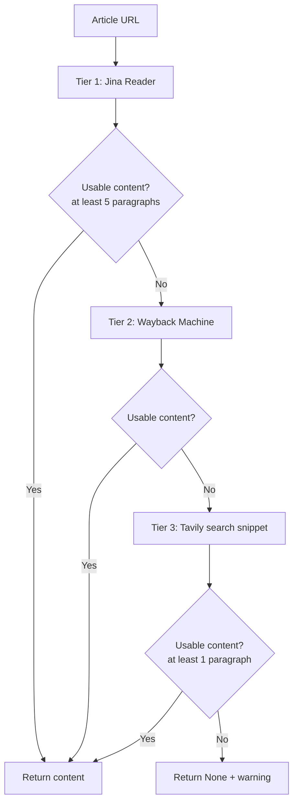
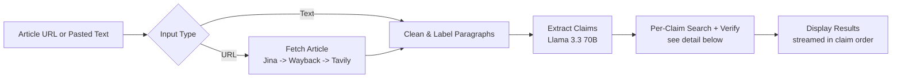
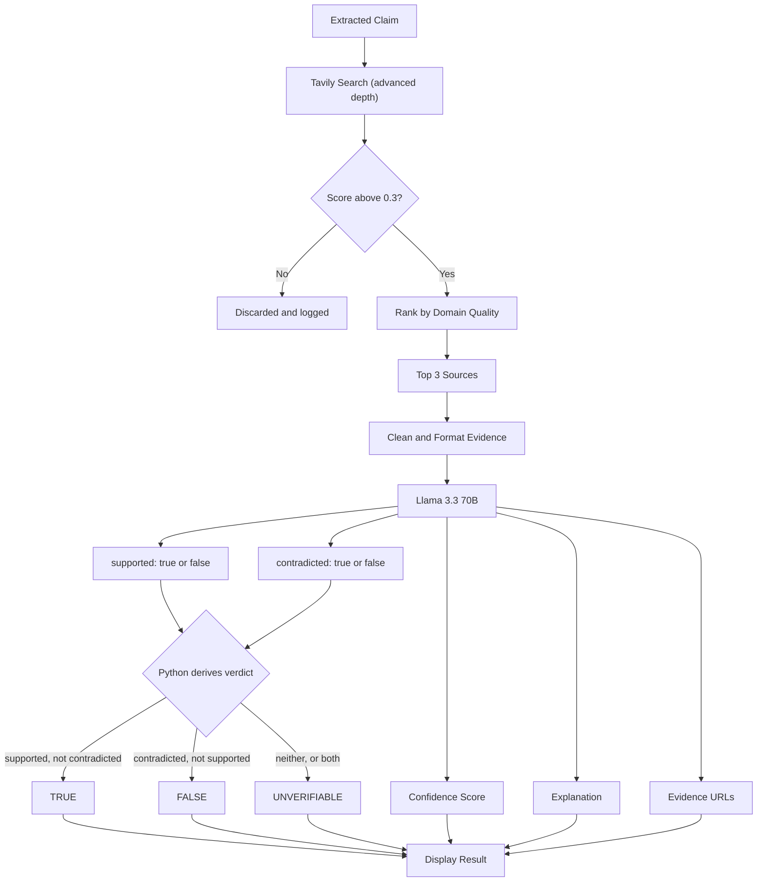

# Real-Time Fact Checker

## Project Objective

The primary objective of this project is to develop a real-time fact-checking system that helps users verify factual claims from news articles, live speeches, and video streams. The motivation for this project comes from the increasing difficulty of determining whether information presented by news media or public figures is accurate. In Indonesia, as in many other countries, people are often exposed to conflicting reports from different media outlets, making it challenging to distinguish verified information from misinformation or incomplete reporting.

Public speeches delivered by government officials and political leaders can also contain a large number of factual claims that are difficult for viewers to verify in real time. Since these speeches are often broadcast live and widely shared online, inaccurate or misleading statements can spread quickly before they are independently checked.

To address this problem, the proposed system automatically extracts factual claims from multiple input sources, including live microphone input, live video streams, news articles, and manually entered text. Each claim is then verified against information gathered from multiple reliable online sources before assigning a verdict such as **TRUE**, **FALSE**, or **UNVERIFIABLE**, together with an explanation and supporting evidence.

The goal is not to determine political opinions or judge individuals, but to provide users with an independent tool that assists them in verifying factual statements. By enabling near real-time verification of news reports and live speeches, the system aims to reduce the spread of misinformation, improve transparency, and help users make more informed decisions based on verifiable evidence. This approach is consistent with the broader purpose of fact-checking, which focuses on objectively verifying factual claims using transparent evidence and reliable sources.

**4 input modes:**
- **Microphone** -> Live speech fact-checking
- **Live stream URL** -> YouTube/news broadcast verification
- **Article URL** -> Web article claim extraction & verification
- **Paste text** -> Copy-paste content fact-checking

---

## In-Depth Project Overview

The Fact Checker is an intelligent verification system designed to combat misinformation in real-time. It operates on a three-stage pipeline: **capture -> extract -> verify**.

The system accepts information from different sources: article URLs and pasted text are working today. Live microphone input and live stream URLs are planned but currently just show a "Coming Soon" placeholder (Modes 1 and 2). Text is analyzed by the Llama 3.3 70B model (served via DeepInfra), which extracts the 15 most specific and fact-based claims, while ignoring opinions, predictions, or unclear statements.

After the claims are extracted, the system searches the internet using Tavily's web search API to find reliable evidence. Multiple searches are performed at the same time to improve speed, and low-quality social/UGC sources (Facebook, YouTube, X, Reddit, etc.) are filtered out. The Llama 3.3 70B model then verifies **each claim in its own call** (run concurrently) and classifies it on a 3-tier scale: TRUE, UNVERIFIABLE, or FALSE. Results are revealed one by one, in claim order, as each verdict lands. Each result includes a confidence score (60-100%), a short explanation, and links to the supporting sources.

For website URLs, it uses a three-step fallback method: first trying Jina Reader to extract the article, then the Wayback Machine if the page cannot be accessed, and finally Tavily Search to gather evidence from other trusted sources. This allows the system to verify content even if an article is behind a paywall or blocks automated access. It can also verify multiple claims from a single input.

---

## Tech Stack

| Component | Technology | Purpose |
|---|---|---|
| **Language** | Python 3.13.5 | Core application |
| **LLM Model** | Llama 3.3 70B (via DeepInfra) | Claim extraction & verification |
| **Web Search** | Tavily Search API | Find evidence for claims |
| **Web Scraping** | Jina Reader API | Extract article text |
| **Archive Access** | Wayback Machine API | Access archived page versions |
| **Parallel Processing** | ThreadPoolExecutor | Concurrent search operations |
| **Output** | JSON + Terminal UI | Color-coded results display with 3-tier verdict |

Modes 1 (Microphone) and 2 (Live stream) are currently placeholders with no audio
capture or transcription dependencies wired in yet.

**Services:**
- **DeepInfra** = LLM inference (Llama 3.3 70B), OpenAI-compatible API
  - Roughly $3/month at light usage
- **Tavily** = Web search API
  - Free tier: ~100 searches/month
  - Each query pulls up to 10 results with social/UGC domains excluded server-side; the top 3 are kept after ranking (official sources first, Wikipedia second, unrecognized domains last), 600-char snippets
- **Jina Reader** = Article text extraction
  - No auth required, free tier available
- **Wayback Machine** = Internet Archive snapshots
  - Free, no authentication needed

---

## How It Works

### Step 1: Capture
- **Microphone:** Mode 1, coming soon (currently a placeholder)
- **Live Stream:** Mode 2, coming soon (currently a placeholder)
- **URL:** Fetch article via Jina -> Wayback -> Tavily fallback chain
- **Text:** Accept manually pasted content

**Article fetch fallback chain** (Mode 3 only - Mode 4 skips straight to cleaning):



### Step 2: Extract Claims
- Send the text to the Llama 70B model
- Model extracts up to 15 specific, verifiable claims
- Filter out opinions, predictions, rhetorical questions

### Step 3: Verify
- For each claim, search web via Tavily (600-char snippets; pulls 10, social/UGC excluded server-side, keeps top 3 after ranking)
- Verify each claim in its own Llama 70B call, run concurrently
- Model assigns a 3-tier verdict: TRUE / UNVERIFIABLE / FALSE
- Return confidence score (60-100%), explanation, and source URLs, streamed in claim order

### Smart Features
- **Streaming results:** Each verdict prints the moment it's ready, in claim order, no waiting for the whole batch
- **3-tier verdicts:** TRUE / UNVERIFIABLE / FALSE for more precise calls
- **Live-state guard:** Claims about current/ongoing state (vote counts, current officeholder) with no recent, direct evidence return UNVERIFIABLE instead of a guess
- **Comparative-claim guard:** Superlative claims ("nearer than ever," "best ever") require explicit historical evidence, not just general trend data
- **Source filtering:** Social/UGC domains (Facebook, YouTube, X, Reddit, TikTok, Medium) are excluded at the Tavily API level via `exclude_domains`, not filtered after the fact
- **Source ranking:** Official/high-quality domains (Reuters, AP, BBC, .gov, WHO, World Bank, UN, IMF, Nature, etc.) are prioritized first; Wikipedia ranks below those but above unrecognized domains, so it's demoted, not buried behind an arbitrary blog
- **Entity-aware search queries:** Claim extraction includes the specific named person/company/organization in the search query so primary sources surface over generic aggregator sites
- **Fallback chain:** If a page is thin or blocked, try archive then search, gated on real cleaned content, not byte count
- **Parallel within each phase:** All claims are searched concurrently, then all claims are verified concurrently, for speed
- **Robust JSON parsing:** Recovers verdicts even when the model returns malformed or truncated JSON (incl. unquoted bare enums)

---

## Code Flow

**Pipeline overview** - capture -> extract -> search/verify (per claim) -> display:



Call chain for Mode 3 (Article URL) and Mode 4 (Paste text), the two working modes:





Step 2 runs concurrently across all claims, then step 3 runs concurrently across all claims
(`ThreadPoolExecutor` each time); step 4 still reveals results one at a time, in the original
claim order, as each one finishes.

### Functions

**main.py**

| Function | Role |
|---|---|
| `main()` | Prints the menu, dispatches to the chosen mode |
| `run_mic()` | Mode 1:Microphones, IRL fact checker - Coming Soon|
| `run_stream()` | Mode 2: Live Stream, Youtube, etc - Coming Soon |
| `run_article()` | Mode 3: fetch, clean, and fact-check an article URL |
| `run_text()` | Mode 4: clean and fact-check pasted text |
| `_fetch_article()` | 3-tier fetch: Jina Reader -> Wayback Machine -> Tavily search |
| `_usable()` | Gate: does the fetched content have >= 5 real paragraphs after cleaning? |
| `_clean_article()` | Strips markdown noise, splits text into `[SPEAKER_A]`-labeled paragraphs |
| `_print_one_result()` | Wraps one verdict in a list and hands it to `show_results()` |

**fact_checker.py**

| Function | Role |
|---|---|
| `fact_check()` | Extract -> search -> verify, streams results via `on_result` |
| `_chat()` | Sends one message to the LLM (DeepInfra) and returns its reply |
| `_deepinfra_()` | Lazy singleton client for the LLM |
| `_tavily_()` | Lazy singleton client for Tavily search |
| `_parse_json_array()` | Recovers a clean JSON array from imperfect model output |
| `_search()` | Runs one Tavily search for a claim's query |
| `_filter_sources()` | Ranks results: official sources first, Wikipedia second, unrecognized domains last |
| `_verify_one()` | Verifies a single claim against its own search results |

**display.py**

| Function | Role |
|---|---|
| `show_results()` | Prints verdict, confidence bar, explanation, and sources |
| `_bar()` | Renders the confidence percentage as a text bar |
| `_format_source()` | Appends a Wikipedia caveat note to a source URL, if applicable |

### Worked example: one claim, start to finish

Input text (Mode 4, pasted): `"ChatGPT was publicly released by OpenAI in November 2022."`

1. **`_clean_article()`** turns it into `"[SPEAKER_A] ChatGPT was publicly released by OpenAI in November 2022."`
2. **EXTRACT** - `_chat(EXTRACT_PROMPT, ...)` returns:
   ```json
   [{"claim": "ChatGPT was publicly released by OpenAI in November 2022",
     "query": "OpenAI ChatGPT public release November 2022",
     "speaker": "SPEAKER_A"}]
   ```
3. **SEARCH** - `_search("OpenAI ChatGPT public release November 2022")` calls Tavily (UGC domains already excluded), then `_filter_sources()` ranks the results - a Reuters/history.com-type source moves ahead of Wikipedia - and returns the top 3 as one text block plus their URLs.
4. **VERIFY** - `_verify_one()` sends the claim + that text block to `_chat(VERIFY_PROMPT, ...)`, which returns:
   ```json
   [{"speaker": "SPEAKER_A",
     "claim": "ChatGPT was publicly released by OpenAI in November 2022",
     "verdict": "TRUE", "confidence": 95,
     "explanation": "Two independent sources confirm the November 2022 public release.",
     "sources": ["https://www.history.com/...", "https://en.wikipedia.org/wiki/ChatGPT"]}]
   ```
5. **DISPLAY** - `on_result` fires immediately, `_print_one_result()` wraps it in a list and calls `show_results()`, which prints:
   ```
   [TRUE]  SPEAKER_A
     Claim:  ChatGPT was publicly released by OpenAI in November 2022
     Conf:   [===================-] 95%
     Why:    Two independent sources confirm the November 2022 public release.
     Sources (2):
       = https://www.history.com/...
       = https://en.wikipedia.org/wiki/ChatGPT [Note: Wikipedia, community-edited]
   ```

If the input had 15 claims instead of 1, steps 2-4 would run for all 15 concurrently (via `ThreadPoolExecutor`), but step 5 still prints them one at a time, in the original claim order, as each one finishes - not all-at-once at the end.

---

## Bug Fixes

Three correctness issues found and fixed in `main.py`:

1. **Invalid menu choice printed the wrong thing.** `main()`'s `else` branch used
   to do `print(ValueError)`, which prints the literal text `<class 'ValueError'>`
   instead of a real message. Now prints `"ERROR: Invalid choice, pick 1-4"`.

2. **Lost source provenance in `_fetch_article()`.** The Wayback Machine and
   Tavily fallback tiers only appended their "Fetched from ..." note when an
   earlier warning was already set, due to operator precedence in
   `warning + "note" if warning else ""` (parses as `(warning + "note") if
   warning else ""`). Since `warning` is only set when Jina returns unusable
   content, not when Jina throws an exception, a Jina timeout followed by a
   successful Wayback/Tavily fetch used to silently drop the provenance note -
   the user had no way to know the content came from an archive or a search
   snippet rather than the live page. Now the note is always appended,
   regardless of `warning`'s prior state.

3. **`url.split("/")[2]` assumed the URL had a scheme.** The Tavily fallback
   tier extracted the domain this way, which throws `IndexError` on a
   schemeless URL (`example.com/path` instead of `https://example.com/path`),
   silently swallowed by the tier's broad `except Exception`. `run_article()`
   never validates the URL before passing it through, so a user pasting a bare
   domain would trigger this. Fixed by normalizing a missing scheme and using
   `urllib.parse.urlparse(...).netloc` instead.

---

## Setup
Install dependencies:

```bash
pip install -r requirements.txt
```

---

## Quick Start
```bash
python main.py
```

Choose a mode (1-4), provide input, and get instant prediction with sources.
